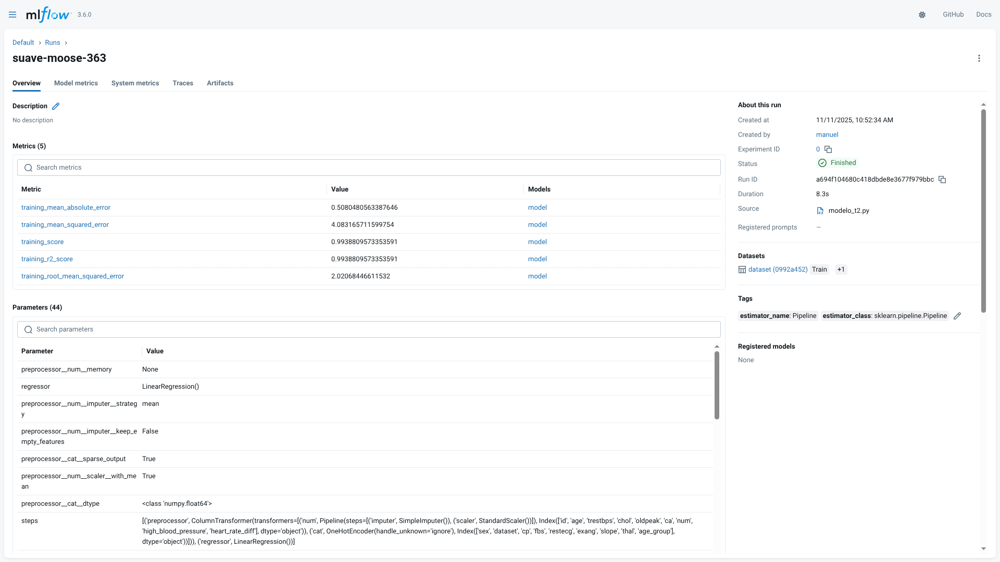
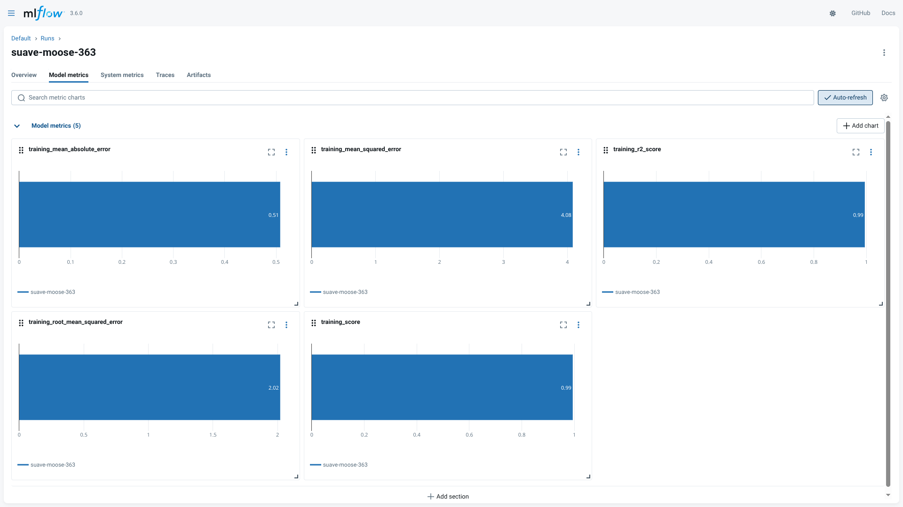
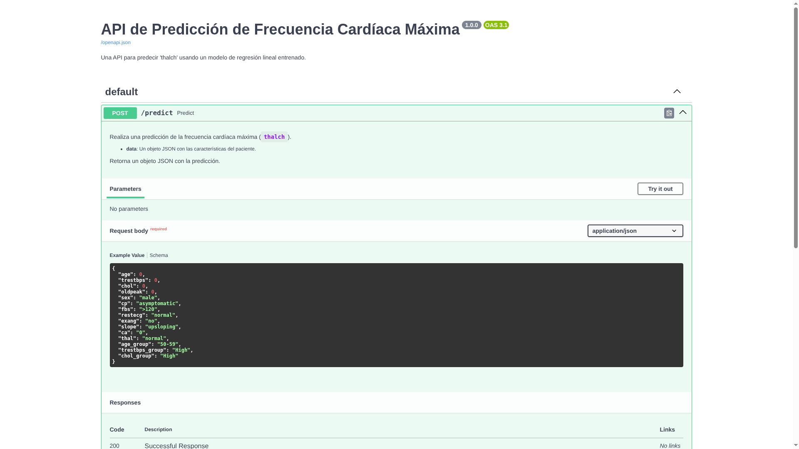

# Taller Final 
## Machine Learning para Modelos de Predicción
### Especialización en Analítica y Ciencia de Datos Aplicada | UTP

**Tarea**

1. Para el modelo resultado del Taller 2, realizar un flujo de trabajo de experimentación con MLflow. Como producto, deberán entregar el código y un documento con capturas de pantalla de la interfaz de usuario (UI) desplegada.
2. Para el modelo resultado del taller 2, realizar la implementación de una API con FASTAPI, como producto deberán entregar el código y un documento con pantallazos del DOCs generado por FASTAPI desplegado y una predicción.

## Sumario de metodos y resultados

### Ambiente de desarrollo

**Despliege de un ambiente virtual con Python en linux**

```bash
# 1. Crear un entorno virtual
python -m venv .venv
# 2. Activar el entorno virtual
source .venv/bin/activate
``` 

**Instalar Requerimientos**

```
pip install -r requirements.txt
```

[requirements.txt](./requirements.txt)

```txt
pandas 
numpy 
matplotlib
scikit-learn
seaborn
mlflow
fastapi
uvicorn
python-multipart
```

**Copia del codigo base del taller anterior de entrenamiento de modelo**

```python
# 1. Importar las librerías necesarias
import pandas as pd
from datetime import datetime
import matplotlib.pyplot as plt
import seaborn as sns
from sklearn.model_selection import train_test_split
from sklearn.linear_model import LinearRegression
from sklearn.metrics import mean_squared_error, r2_score
from sklearn.preprocessing import OneHotEncoder, StandardScaler
from sklearn.compose import ColumnTransformer
from sklearn.pipeline import Pipeline
from sklearn.impute import SimpleImputer
import os

# Configuración para una mejor visualización
sns.set_style('whitegrid')
plt.rcParams['figure.figsize'] = (12, 6)

def save_dataframe_to_csv(df, base_filename="base_2"):
    """
    Guarda un DataFrame en un archivo CSV en la carpeta del proyecto.
    Añade una marca de tiempo al nombre del archivo para evitar sobrescribir.

    Args:
        df (pd.DataFrame): El DataFrame que se va a guardar.
        base_filename (str): El nombre base para el archivo CSV.
    """
    # Crear un nombre de archivo único con una marca de tiempo
    timestamp = datetime.now().strftime("%Y%m%d_%H%M%S")
    filename = f"{base_filename}_{timestamp}.csv"
    try:
        df.to_csv(filename, index=False)
        print(f"\nDataFrame guardado exitosamente como: {filename}")
    except Exception as e:
        print(f"\nOcurrió un error al guardar el archivo: {e}")

# 2. Cargar el dataset en un DataFrame de pandas
try:
    df = pd.read_csv('engineered_heart_data.csv')
    print("Dataset 'engineered_heart_data.csv' cargado exitosamente.")
except FileNotFoundError:
    print("Error: El archivo 'engineered_heart_data.csv' no se encontró.")
    print("Asegúrate de que el archivo CSV generado en el Taller 1 esté en el mismo directorio.")
    df = None

if df is not None:
    # 3. Preparación de datos para la regresión
    print("\n--- Preparando datos para el modelo de regresión ---")

    # Seleccionar la variable objetivo
    TARGET_VARIABLE = 'thalch'
    print(f"Variable objetivo: {TARGET_VARIABLE}")

    # Eliminar filas con valores nulos en la variable objetivo
    df.dropna(subset=[TARGET_VARIABLE], inplace=True)

    # Separar características (X) y objetivo (y)
    X = df.drop(TARGET_VARIABLE, axis=1)
    y = df[TARGET_VARIABLE]

    # Identificar columnas categóricas y numéricas
    categorical_features = X.select_dtypes(include=['object', 'category']).columns
    numerical_features = X.select_dtypes(include=['int64', 'float64']).columns

    print(f"Columnas categóricas: {list(categorical_features)}")
    print(f"Columnas numéricas: {list(numerical_features)}")

    # Crear un transformador para preprocesar las columnas
    preprocessor = ColumnTransformer(
        transformers=[
            ('num', Pipeline(steps=[
                ('imputer', SimpleImputer(strategy='mean')),
                ('scaler', StandardScaler())
            ]), numerical_features),
            ('cat', OneHotEncoder(handle_unknown='ignore'), categorical_features)
        ])
    
    # Dividir los datos en conjuntos de entrenamiento y prueba
    X_train, X_test, y_train, y_test = train_test_split(X, y, test_size=0.2, random_state=42)

    # 4. Entrenamiento del modelo de Regresión Lineal
    print("\n--- Entrenando modelo de Regresión Lineal ---")
    model = LinearRegression()
    
    # Ajustar el preprocesador y transformar los datos de entrenamiento
    X_train_processed = preprocessor.fit_transform(X_train)
    model.fit(X_train_processed, y_train)
    print("Modelo entrenado exitosamente.")

    # 4.1. Mostrar coeficientes del modelo
    print("\n--- Coeficientes del Modelo de Regresión Lineal ---")
    feature_names = preprocessor.get_feature_names_out()
    coefficients = pd.DataFrame({'Feature': feature_names, 'Coefficient': model.coef_})
    coefficients['Absolute_Coefficient'] = abs(coefficients['Coefficient'])
    coefficients = coefficients.sort_values(by='Absolute_Coefficient', ascending=False)
    print(coefficients.drop(columns='Absolute_Coefficient').to_string())


    # 5. Evaluación del modelo
    print("\n--- Evaluando el modelo ---")
    # Procesar los datos de prueba
    X_test_processed = preprocessor.transform(X_test)
    y_pred = model.predict(X_test_processed)

    # Calcular métricas
    mse = mean_squared_error(y_test, y_pred)
    r2 = r2_score(y_test, y_pred)

    # Mostrar métricas en formato de tabla
    metrics_df = pd.DataFrame({
        'Metric': ['Error Cuadrático Medio (MSE)', 'Coeficiente de Determinación (R²)'],
        'Value': [f"{mse:.2f}", f"{r2:.2f}"]
    })
    print(metrics_df.to_string(index=False))

    # 6. Visualización de los resultados
    # Gráfico de valores reales vs. predichos
    plt.figure(figsize=(10, 6))
    sns.regplot(x=y_test, y=y_pred, scatter_kws={'alpha':0.6})
    plt.xlabel("Valores Reales (thalch)")
    plt.ylabel("Predicciones del Modelo")
    plt.title("Regresión Lineal: Valores Reales vs. Predicciones")
    plt.show()

    # Gráfico de residuos
    plt.figure(figsize=(10, 6))
    sns.residplot(x=y_pred, y=y_test - y_pred, scatter_kws={'alpha': 0.5})
    plt.xlabel("Predicciones del Modelo")
    plt.ylabel("Residuos")
    plt.title("Gráfico de Residuos")
    plt.show()

```

**Modificación del codigo base del taller anterior de entrenamiento de modelo**

[modelo_t2.py](./modelo_t2.py)

```python
# 1. Importar las librerías necesarias
import pandas as pd
from datetime import datetime
import matplotlib.pyplot as plt
import seaborn as sns
from sklearn.model_selection import train_test_split
from sklearn.linear_model import LinearRegression
from sklearn.metrics import mean_squared_error, r2_score
from sklearn.preprocessing import OneHotEncoder, StandardScaler
from sklearn.compose import ColumnTransformer
from sklearn.pipeline import Pipeline
from sklearn.impute import SimpleImputer
import os
import mlflow

# Configuración para una mejor visualización
sns.set_style('whitegrid')
plt.rcParams['figure.figsize'] = (12, 6)

def save_dataframe_to_csv(df, base_filename="base_2"):
    """
    Guarda un DataFrame en un archivo CSV en la carpeta del proyecto.
    Añade una marca de tiempo al nombre del archivo para evitar sobrescribir.

    Args:
        df (pd.DataFrame): El DataFrame que se va a guardar.
        base_filename (str): El nombre base para el archivo CSV.
    """
    # Crear un nombre de archivo único con una marca de tiempo
    timestamp = datetime.now().strftime("%Y%m%d_%H%M%S")
    filename = f"{base_filename}_{timestamp}.csv"
    try:
        df.to_csv(filename, index=False)
        print(f"\nDataFrame guardado exitosamente como: {filename}")
    except Exception as e:
        print(f"\nOcurrió un error al guardar el archivo: {e}")

# 2. Cargar el dataset en un DataFrame de pandas
try:
    df = pd.read_csv('engineered_heart_data.csv')
    print("Dataset 'engineered_heart_data.csv' cargado exitosamente.")
except FileNotFoundError:
    print("Error: El archivo 'engineered_heart_data.csv' no se encontró.")
    print("Asegúrate de que el archivo CSV generado en el Taller 1 esté en el mismo directorio.")
    df = None

if df is not None:
    # 3. Preparación de datos para la regresión
    print("\n--- Preparando datos para el modelo de regresión ---")

    # Seleccionar la variable objetivo
    TARGET_VARIABLE = 'thalch'
    print(f"Variable objetivo: {TARGET_VARIABLE}")

    # Eliminar filas con valores nulos en la variable objetivo
    df.dropna(subset=[TARGET_VARIABLE], inplace=True)

    # Separar características (X) y objetivo (y)
    X = df.drop(TARGET_VARIABLE, axis=1)
    y = df[TARGET_VARIABLE]

    # Identificar columnas categóricas y numéricas
    categorical_features = X.select_dtypes(include=['object', 'category']).columns
    numerical_features = X.select_dtypes(include=['int64', 'float64']).columns

    print(f"Columnas categóricas: {list(categorical_features)}")
    print(f"Columnas numéricas: {list(numerical_features)}")

    # Convertir columnas numéricas a float64 para evitar advertencias de MLflow
    # sobre esquemas con enteros que no soportan valores nulos.
    X[numerical_features] = X[numerical_features].astype('float64')

    # Crear un transformador para preprocesar las columnas
    preprocessor = ColumnTransformer(
        transformers=[
            ('num', Pipeline(steps=[
                ('imputer', SimpleImputer(strategy='mean')),
                ('scaler', StandardScaler())
            ]), numerical_features),
            ('cat', OneHotEncoder(handle_unknown='ignore'), categorical_features)
        ])
    
    # Dividir los datos en conjuntos de entrenamiento y prueba
    X_train, X_test, y_train, y_test = train_test_split(X, y, test_size=0.2, random_state=42)

    # Establecer la URI de seguimiento de MLflow para usar el servidor local
    mlflow.set_tracking_uri("http://localhost:5000")

    # Habilitar autologging para scikit-learn
    mlflow.sklearn.autolog()

    # Iniciar un "run" de MLflow
    with mlflow.start_run():
        # 4. Entrenamiento del modelo de Regresión Lineal
        print("\n--- Entrenando modelo de Regresión Lineal ---")
        # Crear y entrenar un pipeline que incluye el preprocesador y el modelo
        pipeline = Pipeline(steps=[('preprocessor', preprocessor),
                                ('regressor', LinearRegression())])
        pipeline.fit(X_train, y_train)
        print("Modelo entrenado exitosamente.")

        # 4.1. Mostrar coeficientes del modelo
        print("\n--- Coeficientes del Modelo de Regresión Lineal ---")
        # Acceder a los pasos del pipeline para obtener la información
        preprocessor_step = pipeline.named_steps['preprocessor']
        regressor_step = pipeline.named_steps['regressor']
        feature_names = preprocessor_step.get_feature_names_out()
        coefficients = pd.DataFrame({'Feature': feature_names, 'Coefficient': regressor_step.coef_})
        coefficients['Absolute_Coefficient'] = abs(coefficients['Coefficient'])
        coefficients = coefficients.sort_values(by='Absolute_Coefficient', ascending=False)
        print(coefficients.drop(columns='Absolute_Coefficient').to_string())

        # 5. Evaluación del modelo
        print("\n--- Evaluando el modelo ---")
        y_pred = pipeline.predict(X_test)

        # Calcular métricas
        mse = mean_squared_error(y_test, y_pred)
        r2 = r2_score(y_test, y_pred)

        # Mostrar métricas en formato de tabla
        metrics_df = pd.DataFrame({
            'Metric': ['Error Cuadrático Medio (MSE)', 'Coeficiente de Determinación (R²)'],
            'Value': [f"{mse:.2f}", f"{r2:.2f}"]
        })
        print(metrics_df.to_string(index=False))

        # 6. Visualización de los resultados
        # Gráfico de valores reales vs. predichos
        plt.figure(figsize=(10, 6))
        sns.regplot(x=y_test, y=y_pred, scatter_kws={'alpha':0.6})
        plt.xlabel("Valores Reales (thalch)")
        plt.ylabel("Predicciones del Modelo")
        plt.title("Regresión Lineal: Valores Reales vs. Predicciones")
        plt.show()

        # Gráfico de residuos
        plt.figure(figsize=(10, 6))
        sns.residplot(x=y_pred, y=y_test - y_pred, scatter_kws={'alpha': 0.5})
        plt.xlabel("Predicciones del Modelo")
        plt.ylabel("Residuos")
        plt.title("Gráfico de Residuos")
        plt.show()
```

**Reciclaje del modelo de MLFlow en una FastAPI**

[api.py](./api.py)

```python
import mlflow
import pandas as pd
from fastapi import FastAPI, HTTPException
from pydantic import BaseModel, Field
from typing import Optional

# Inicializar la aplicación FastAPI
app = FastAPI(
    title="API de Predicción de Frecuencia Cardíaca Máxima",
    description="Una API para predecir 'thalch' usando un modelo de regresión lineal entrenado.",
    version="1.0.0"
)

# --- Carga del Modelo ---
# Establecer la URI de seguimiento de MLflow para conectarse al servidor
mlflow.set_tracking_uri("http://localhost:5000")

try:
    # Obtener el último 'run' del experimento por defecto (experiment_id='0')
    runs = mlflow.search_runs(experiment_ids=['0'], order_by=["start_time DESC"], max_results=1)
    if runs.empty:
        raise RuntimeError("No se encontraron runs en MLflow.")
    
    latest_run_id = runs.iloc[0].run_id
    # Construir la URI del modelo
    model_uri = f"runs:/{latest_run_id}/model"
    
    # Cargar el pipeline del modelo (que incluye preprocesador y regresor)
    model = mlflow.pyfunc.load_model(model_uri)
    print(f"Modelo cargado exitosamente desde el run_id: {latest_run_id}")

except Exception as e:
    print(f"Error al cargar el modelo desde MLflow: {e}")
    # Si no se puede cargar el modelo, la API no podrá hacer predicciones.
    # Podríamos detener el inicio de la app, pero por ahora solo imprimiremos el error.
    model = None

# --- Definición del Modelo de Datos de Entrada ---
# Pydantic model para validar los datos de entrada de la API
class HeartDataInput(BaseModel):
    age: float
    trestbps: float
    chol: float
    oldpeak: float
    sex: str = Field(..., example="male")
    cp: str = Field(..., example="asymptomatic")
    fbs: str = Field(..., example=">120")
    restecg: str = Field(..., example="normal")
    exang: str = Field(..., example="no")
    slope: str = Field(..., example="upsloping")
    ca: str = Field(..., example="0")
    thal: str = Field(..., example="normal")
    age_group: str = Field(..., example="50-59")
    trestbps_group: str = Field(..., example="High")
    chol_group: str = Field(..., example="High")

# --- Endpoint de Predicción ---
@app.post("/predict")
def predict(data: HeartDataInput):
    """
    Realiza una predicción de la frecuencia cardíaca máxima (`thalch`).

    - **data**: Un objeto JSON con las características del paciente.
    
    Retorna un objeto JSON con la predicción.
    """
    if model is None:
        raise HTTPException(status_code=503, detail="Modelo no disponible. Revise los logs del servidor.")

    try:
        # Convertir los datos de entrada Pydantic a un DataFrame de pandas
        input_df = pd.DataFrame([data.model_dump()])
        
        # Realizar la predicción
        prediction = model.predict(input_df)
        
        # Devolver la predicción en una respuesta JSON
        return {"predicted_thalch": prediction[0]}
    except Exception as e:
        raise HTTPException(status_code=400, detail=f"Error durante la predicción: {str(e)}")
```
**Despliege de el servidor de MLFlow y FastAPI**
```bash
mlflow ui
```
```bash
python modelo_t2.py
```
```bash
uvicorn api:app --reload
```

**Estructura del proyecto**

```txt
.
├── .venv/
├── api.py                      
├── engineered_heart_data.csv
├── modelo_t2.py
├── requirements.txt
└── README.md
```

**Integración MLFlow y FastAPI**

Este proyecto integra MLflow para el seguimiento de experimentos y gestión de modelos, y FastAPI para la exposición del modelo entrenado como un servicio web.

1.  **Entrenamiento y Seguimiento con MLflow (`modelo_t2.py`)**:
    *   El script `modelo_t2.py` entrena un modelo de regresión lineal para predecir la frecuencia cardíaca máxima (`thalch`).
    *   **MLflow Tracking**: Cada ejecución del script se registra como un "run" en MLflow. Esto incluye:
        *   **Parámetros**: Los hiperparámetros del modelo (aunque en este caso `LinearRegression` no tiene muchos ajustables, MLflow registra los predeterminados).
        *   **Métricas**: Métricas de evaluación como el Error Cuadrático Medio (MSE) y el Coeficiente de Determinación (R²) se registran automáticamente gracias a `mlflow.sklearn.autolog()`.
        *   **Artefactos**: El modelo entrenado (un pipeline que incluye preprocesamiento y el regresor) se guarda como un artefacto en el formato `mlflow.pyfunc`, lo que facilita su posterior carga y uso.
    *   **Interfaz de Usuario (UI) de MLflow**: Al ejecutar `mlflow ui`, se despliega una interfaz web donde se pueden visualizar y comparar todos los "runs" del experimento.

    **Resultados en la UI de MLflow:**

  **Lista de Experimentos**: La UI muestra un listado de los experimentos, donde cada fila representa un "run" con sus métricas y parámetros principales.




**Detalle de un Run** 
Al hacer clic en un "run" específico, se puede ver un detalle completo que incluye:
**Parámetros**: Los parámetros utilizados para el entrenamiento.
  **Métricas** Los valores de MSE y R² obtenidos.
  **Artefactos**: Aquí se encuentra el modelo guardado, listo para ser cargado.



1.  **Exposición del Modelo con FastAPI (`api.py`)**
* El script `api.py` crea una API RESTful utilizando FastAPI.


    